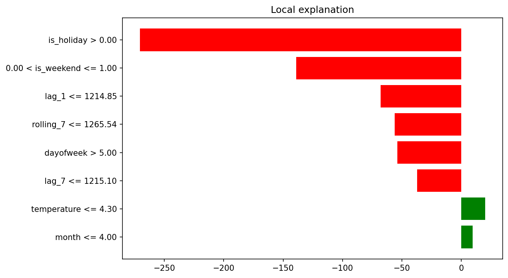

# Energy Consumption Forecaster

Forecasting daily electricity consumption for Germany using Open Power System Data.
Built to practice forecasting methods I used at enercity, where I worked on consumption
models across a portfolio of several thousand customers.

## What it does

Send a date and recent consumption values, and the API returns a predicted consumption
in GWh. It fetches live temperature from Open-Meteo and checks German public holidays
automatically.

Also includes an automated plausibility check. At enercity we had to manually review
hundreds of customer model predictions every day. This automates that check and only
flags the ones that look suspicious.

## Dataset

Open Power System Data, daily electricity consumption for Germany 2012-2017.
Source: https://open-power-system-data.org

## Models

Three models compared on 2017 holdout data (365 days):

1. **Day-of-week baseline** - weighted average of the last 5 same weekday + same month
   values. More recent weeks get higher weight. This is the standard baseline approach
   in operational energy forecasting.

2. **KNN** - k-nearest neighbours using time, lag and weather features.

3. **MLP** - simple two-layer neural network with the same features as KNN.

## Results

| Model | MAE | RMSE | Train time | Inference |
|-------|-----|------|------------|-----------|
| Day-of-week baseline | 48 GWh | 78 GWh | - | 0.11s |
| KNN | 25 GWh | 35 GWh | 0.02s | 0.006s |
| MLP | 20 GWh | 32 GWh | 1.85s | ~0s |

KNN is used in the API. Fast to train, near instant inference, and only slightly
behind MLP on accuracy. Adding temperature and holiday features improved MAE from
29 to 25 compared to using time and lag features only.

## Features used

- Day of week, month, is_weekend
- is_holiday (German public holidays)
- temperature (fetched from Open-Meteo API)
- lag_1 - yesterday's consumption
- lag_7 - same day last week
- rolling_7 - 7-day rolling average

## API

- `GET /health` - check if service is running
- `POST /predict` - get predictions and plausibility check

### Request
```json
{
  "date": "2024-03-08",
  "lag_1": 1350.0,
  "lag_7": 1380.0,
  "special_event": false,
  "model": "knn"
}
```

`model` options: `knn`, `mlp`, `baseline`, `all`

`special_event` - set to true if the customer has notified you of unusual consumption
like a shutdown, production increase or closure. This suppresses the prediction
plausibility warning, but data pipeline issues are still flagged regardless.

### Response
```json
{
  "date": "2024-03-08",
  "model": "all",
  "predictions_gwh": {
    "knn": 1386.85,
    "mlp": 1337.34,
    "baseline": 1463.37
  },
  "temperature_c": 2.5,
  "is_holiday": 0,
  "plausibility": {
    "is_plausible": true,
    "warning": null,
    "expected_range": [1160.93, 1741.4],
    "deviation_pct": 4.4,
    "special_event_mode": false,
    "data_issue": false
  }
}
```

## Plausibility check

Two separate checks run on every prediction:

1. **Input check** - flags if lag_1 deviates more than 50% from the historical mean
   for that weekday and month. This usually means something is wrong in the data
   pipeline. Always runs, cannot be suppressed.

2. **Prediction check** - flags if the prediction deviates more than 20% from recent
   same-weekday historical values. Suppressed if special_event is true.

## Stack

| Layer | Tools |
|-------|-------|
| Data & features | Python, Pandas, PySpark |
| Data pipeline | dbt-duckdb (local DuckDB) |
| Models | Scikit-learn (KNN, MLP) |
| Explainability | SHAP |
| API | FastAPI, Uvicorn |
| Infrastructure | Docker |
| Weather data | Open-Meteo API |

## Architecture

```
  Raw Data
  (OPSD energy CSV + Open-Meteo temperature)
        │
        ▼
  dbt + DuckDB                    clean, join, validate
  stg_energy · stg_weather        16 data quality tests
        │
        ▼
  PySpark / pandas                feature engineering
  lag_1 · lag_7 · rolling_7       day-of-week · month · is_weekend
        │
        ▼
  KNN · MLP · Baseline            trained on 2006–2016, tested on 2017
        │
        ├──▶  SHAP + LIME         KernelExplainer + LimeTabularExplainer → reports/
        │
        └──▶  FastAPI             /predict endpoint with plausibility check
                │
                ▼
              Docker              containerised for deployment
```

## Data pipeline

The dbt project (`dbt_energy/`) runs entirely on local DuckDB — no cloud required.

**Staging models** (views):
- `stg_energy` — casts and null-filters the raw OPSD consumption CSV
- `stg_weather` — casts and null-filters the Open-Meteo temperature CSV

**Mart model** (table):
- `fct_energy_features` — joins both staging models, then uses DuckDB window
  functions to add `lag_1`, `lag_7`, a 7-day rolling average, and a 7-day rolling
  stddev. Rows with any null lag or rolling value are dropped, matching the pandas
  preprocessing logic exactly.

**Data quality tests** — 16 tests defined in `models/schema.yml`, all passing:
- `not_null` on every key column across all three models
- `unique` on every date column
- `accepted_values` on `day_of_week` (0–6) and `is_weekend` (0–1)

## Explainability

Two complementary model-agnostic methods are used, both working through the same
prediction function wrapper so the KNN and scaler are only trained once.

### SHAP

`KernelExplainer` perturbs inputs against a background of 100 random training
samples and attributes the prediction change to each feature using Shapley values.
Shapley values satisfy additivity and consistency, so contributions across features
always sum to the full prediction. Slower than LIME but globally coherent across
all 50 explained predictions.

**Summary plot** — feature importance ranked across 50 test predictions:


**Waterfall plot** — per-feature contribution for a single prediction:


### LIME

`LimeTabularExplainer` fits a weighted linear surrogate model in the local
neighbourhood of a single instance by sampling nearby points and seeing how the
prediction changes. Faster than SHAP and useful for quick per-prediction
inspection, but the explanation is local only and can vary slightly between runs
(fixed here with `random_state=42`).

**LIME explanation** — feature contributions for the same single prediction:



## How to run

**Train models:**
```bash
pip install -r requirements.txt
python3 src/train.py
```

**Generate SHAP and LIME plots:**
```bash
python3 src/explain.py
# → reports/shap_summary.png, reports/shap_waterfall.png, reports/lime_explanation.png
```

**Run dbt pipeline (local DuckDB):**
```bash
pip install dbt-duckdb
cd dbt_energy
dbt seed --profiles-dir .
dbt run  --profiles-dir .
dbt test --profiles-dir .
```

**Run PySpark feature engineering:**
```bash
# requires Java 17+
JAVA_HOME=/opt/homebrew/opt/openjdk@17 python3 src/spark_features.py
# → data/processed/spark_features.parquet/
```

**Run API locally:**
```bash
uvicorn src.api:app --reload
```

**Run with Docker:**
```bash
docker build -t energy-forecaster .
docker run -p 8000:8000 energy-forecaster
```

## Next steps

- LLM email parser to extract special event details from customer notifications
  and automatically set the special_event flag
- Drift monitoring to detect when model performance degrades
- Streamlit dashboard for visualising predictions and plausibility flags
- GitHub Actions for automated testing